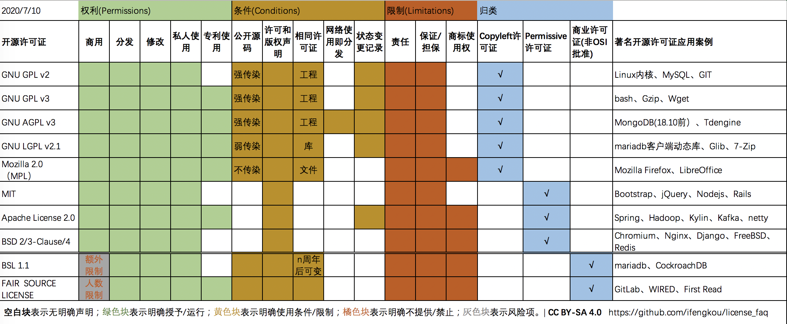

## 开源软件和开源许可证

随着开源的蓬勃发展，**开源软件早已成为众多企业和软件项目的基础设施**。Top500超级计算机都使用基于Linux内核的操作系统[2]；全世界Top1000万个网站有70%使用的是开源的web服务器[3]。在软件各个领域中都有广为人知的开源明星，操作系统有Linux、Android，数据库有Mysql、PostgreSQL、MongoDb、Redis，大数据平台有Hadoop、ElasticSearch、Spark，Web服务器有Tomcat、Apache、Nginx、Node.js，虚拟化有KVM、Docker、Kubernetes，人工智能有Tensorflow、Scikit-learn。开源早已渗透到各行各业，成为计算机软件行业不可缺少的支柱产业。

### 什么是开源软件

开源软件(open source software，简称OSS)，有时也被称为自由开源软件(Free& Open Source Software，FOSS)。 开源软件区别于专有软件、闭源软件， 开源软件是指向社会公众开放软件源代码，开源软件著作权人通过许可协议的方式将部分著作权( 例如复制权，修改权、发行权) 无偿授予愿意接受许可证的人，让被许可人可以在源代码基础上自由使用、复制、修改和再分发[1]。

如果只是将源码公开，例如放到Github等代码托管平台，而未明确声明相应的权利许可，或者是作者设置了自由使用的条件限制，例如禁止商用和限制派生产品的Discuz，限制用户数的Gitlab，这些软件均不能被称之为开源软件[1]。在软件行业，一般认为开源软件对应的是使用了**开放源代码倡议组织**（Open Source Initiative,简称OSI）批准的许可证的软件

OSI目前批准的开源许可证有上百种，且绝大部分的许可证都只有英文版，而且都是类似法律的行文风格，让开源许可证难以理解且不易推广。在实际工作中，对于开源，我有好多好多问号：如果使用了开源软件的代码是否会影响公司的商业软件？GPL为什么被描述为"会传染的病毒"？有这么多GPL类型的许可证，它们有什么区别？如果我自己或者企业有软件产品想要开源，选择哪一种开源许可证更适合自己的诉求？【衔接有问题】

前段时间发生的美国对中国企业和高校的技术管制以及一些开源项目被侵权事件，公司对所使用的中间件进行一次开源排查，也趁此机会对开源许可证进行了一次全面的学习，并将收集到的信息总结成一张对比图。在做对比图时，选取了一些使用非常广泛的开源许可证，如Apache许可证、BSD2/3许可证、GPL系列、MIT许可证、MPL；考虑到最近很多开源软件变更为商业限制许可证，所以在最后也加了2个从开源的基础上衍生出来的商业来源许可证，mariadb的BSL协议和 Gitlab背后的FAIR协议。通过对这些许可证的权利授权项、条件项以及限制项进行分析和对比来全面认识开源许可证【衔接有问题】

一份开源协议通常会包含这3个方面的说明：**赋予哪些权利**、**须承担哪些约束限制**及**相关的责任说明**，每个方面又有几个较为重要的具体项：

权利方面的说明主要包括：是否允许商用、分发、修改、私人使用和是否提供明确的专利许可

约束方面主要有：是否需要公开源代码、是否需要保留版权声明、是否需要用相同的许可证分发、提供网络交互服务是否算分发、是否保留变更记录

限制方面主要有：免责声明、不提供任何保证、是否允许使用商标(名称、商标、标志等商标许可）。

开源许可证在使用宽松程度上，普遍被分为两类：一个是以GPL为代表的**Copyleft许可证**(Copyright 版权的反义词），一个是对用户没有限制相对较少的**宽松式许可证**（Permissive license）。

因近几年开源领域遭遇大量的开源软件（尤其是开源数据库产品）放弃之前的开源许可证[3]，而选择了在使用场景上附加限制条件的商业限制类型的开源许可证，这些许可证也非常具有代表性的，在这里我将其分类为**开源商业限制许可证**，这类型的许可证因为违背了OSI定义的十大开源标准[2]而无法通过OSI批准。

**在如果为你的项目选择相应的许可证时：**

如果你追求你的软件发挥最大的价值，希望其价值及衍生价值能够被更多人自由使用，你应该选择Copyleft类型的许可证，尤其是GNU GPL系列的，因为GPL基本诉求就是要求自由软件的演绎作品在分发时也使用同样的许可证。

如果你追求更多的贡献者来参与你的项目，甚至不在乎其他人制作和分发封闭源代码的版本，那么你应该选择一个较少限制的宽松许可证，例如Apache许可证、MIT、BSD。

如果你在追求开源价值的同时，也希望自己开源的软件能够更大限度的产生商业价值，可以选择开源但是在商业上有使用限制的商业限制许可证。例如mongodb、mariadb就是很好的例子。当然开源软件的商业获利模式远不只有这一条路，红帽在提供开源社区版的同时也提供更稳定且有服务支持的企业版、Kafka选择Apache协议开源但KSQL和配套的企业级服务却采用其他社区或企业协议、Mysql选择了双重许可证方案。

**如果你只是想使用开源软件，那么需要注意这些风险：** 

如果只是使用了开源软件，并不对外分发且不对外提供网络交互服务，除了要特别注意商业限制类的许可证外，其他的开源软件均可以自由使用（包括公司内部使用）。

如果你的软件使用或嵌入了开源软件的代码、或者开发了开源软件的衍生版本，并且对外分发时，那么需要特别注意不能使用那些具备“传染性”的开源许可证，因为这些许可证要求你在分发时使用相同的许可证，也就是说你不能闭源分发。

如果你使用了商业限制类型许可证的软件，在网络上提供SaaS服务或者作为商用用途时，需要特别关注许可证中限制相关的附件条款。例如mongodb在18年弃用AGPL协议变更为SSPL协议后[7]，再在云平台上对外提供使用SSPL协议的mongodb的服务而不提供相关服务的源代码（包含所有的衍生配套），可能面临违约风险和侵权风险。阿里云选择牵手mongodb，获得能够对外提供MongoDB-as-a-service 的授权[8]；腾讯云、AWS却选择基于Mongodb分别推出CMONGO、DynamoDB，这些数据库100% 完全兼容 MongoDB 协议[7]。

更多细节可以见下面的问答章节。

## 问答

### 图中的`分发`和`网络使用即分发`指什么？

许可证授予的权利，允许你自由使用、修改、复制，但是**在“分发”时就必须遵守许可证的约束**。换言之，如果不"分发"，就不需要遵守。

分发就是指将版权作品从一个人转移到另一个人。这意味着，如果你是自己使用，不提供给他人，就没有分发。另外，这里的"人"也指"法人"，因此如果使用方是公司，且只在公司内部使用，也不需要遵守许可证[]。

其中AGPL有个特例：AGPL定义，如果你使用开源软件**提供网络交互服务，那么该行为也定义为“分发”**，即图中的“网络使用即分发”

### 图中的`传染性`指什么？

传染性来源于GPL，GPL的支持者确信自由软件世界应具有自我保护能力和可持续发展性——为了确保自由软件的演绎作品同样“自由”，所以要求只要使用了GPL的代码，那么整个项目都必须以GPL方式公开源代码

LGPL 在这方面要求就没GPL那么严格，如果只是子系统/模块用了，那么只需要子系统/模块开源，整个工程不用开源；如果是以动态链接调用LGPL许可证的库，那么项目也不用开源。

MPL 在这个方面就更宽松，哪个文件用了该许可证的代码，只需要这些文件开源即可，其他文件不受影响

所以，GPL v2/v3、AGPL 属于工程级别的强传染性；LGPL属于库级别的若传染性；MPL 就是文件级别的，传染性可以忽略不计了

### 加上免责等限制项的目的是？

为了避免著作权人后续遭遇法律诉讼。大部分开源许可证最后都会带上免责声明，表明软件是按 “AS IS”提供[3]，拒绝提供任何担保（不论明示或暗示，包括但不限于针对特定目的的适销性和适用性的默示担保），也没有义务提供维护，支持，更新，增强或修改。

### 为什么有这么多GPL，他们的差异是？

AGPL 和 GPL 的区别：

AGPL明确了GPL 2.0/3.0关于提供网络服务也属于分发限制的说明：使用GPL的自由软件，但是并不发布与网络之中，则可以自由的使用GPL协议确不开源自己私有的解决方案。AGPL则增加了对此做法的约束。比如使用了AGPL代码的软件是一个网络应用，那么这个软件的所有源码和修改代码也必须开源

GPL v2 和 GPL v3的主要差异：
   a) GPLv3包含了明确的专利许可

   b) 添加了对数字版权管理和加密签名的限制，不仅要求用户公开源码，还要求公布相关硬件及必要的安装信息。

GPL 和LGPL的区别：

主要区别在于传染性方面，GPL是工程级别的强传染，LGPL是库级别的弱传染

### 商业来源许可证（BSL）许可证是什么？

BSL 特性：

1. 开源，但不属于开源许可证
2. 商业使用上有附加限制条件，超过定义的限制条件，需要购买商业授权许可
3. 有变更日期，在特定时间点上，BSL将授权变更许可证的权利。例如CockroachDB中，在变更日期后，许可证自动变更为Apache协议

在BSL中，源代码始终是免费提供的，并且可以保证在特定时间点（即更改日期）变更为其他开源许可证。在BSL中低于特定级别的使用始终是完全免费的。在更改日期前超过指定级别的使用需要购买商业许可证。

高低级别的附加条件一般由权利人会根据软件特性自己进行定义。比如在mariadb数据库中，附加条件就是最多只能免费使用2个数据库实例，如果超过了2个数据库实例，那么需要向权利人购买高级别的商业授权；CockroachDB的附加条件更简单，只要对外提供商业性服务器就需要购买其商业授权。

类似于BSL的许可证或许是封闭源或开放核心许可模式的新替代品，其诞生的目的更多是为了限制云服务厂商利用开源软件对外提供商业服务。因为多年来云厂商一直都在售卖基于开源项目的云服务，享用了开源社区的成果，却并不给开源社区做贡献[7]。

### BSL 和 FAIR 协议的区别：

在商用上，BSL会根据产品特性自由指定限制项，而FAIR的限定项特指用户数，FAIR20表示限定20个用户免费使用，FAIR50 指限定50个用户免费使用。超过限制规定，则需要购买商业版权

另外BSL 有 在特定日期 变更为 其他开源许可证的特性。

### BSL与GPL  /商业双重许可有何不同？

在GPL中使用双重许可时，公司必须支付商业许可费用才能使用其封闭源代码使用该软件。使用BSL，公司仅在想要使用超出免费使用限制的软件时才付费。

### **我可否使用GPL下的编辑器，比如GNU  Emacs，开发非自由软件？我可否使用GPL下的工具，比如GCC，编译非自由软件**

是的，因为编辑器和工具的版权并不包括你编写的代码。从法律上说，使用这些工具并不对你代码的许可证带来任何限制。

### **java使用的开源协议是gplv2 ce  ，那岂不是用java开发出来的各种网站,工具,只要你发布到了网上 我是不是都可以理解为需要提供源码?** 

“使用”和“基于其开发”是两个不同的概念。你可以“使用”，但是不能包装它，然后当做独立产品发布。如果你把JAVA的源码编译一下，改个名字发布JAVAX语言，那么你是需要开源的。用java 开发出来的网站/工具，可以理解为程序输出

### **当我通过JDBC 方式（MySQL Connector/J JDBC驱动程序）使用了基于GPL的mysql 是否程序也需要开源**

使用mysql 不受GPL限制，用Mysql作为数据库，只算是使用或者属于程序输出。但遗憾的是由于 MySQL Connector/J 驱动也是GPL的，这个驱动包是直接集成在程序中的，如果你对外进行了分发，你的程序也是需要开源。或者可以每年订阅MySQL Network的服务 或者向oracle 申请商业授权

### **开源后，是否还能闭源**

能。但是之前已经发布的版本不能修改许可证，只能针对以后未发布的

### **作者以GPL协议开源了软件，作者是否能够基于开源软件进行修改分发闭源产品**/**我愿意把我写的程序按照GNU GPL发布，但是我也想在非自由软件里使用同样的代码。**

能，作者是版权持有人，依照GPL协议开源，只是通过许可协议的方式将部分著作权( 例如复制权，修改权、发行权) 无偿授予出去

### **1) X按照GPL发布了V1。2) Y在V1的基础上贡献了修改和新代码，开发了V2。3) X想要把V2变成非GPL许可证。X需要Y的许可吗？**

是的。由于 Y 是基于 X 的 V1 版本做出的，所以 Y 要按照 GNU GPL 发布。Y 不必就其代码同意使用任何其他的许可证。所以，X 要想按照其他协议发布 V2，必须要获得 Y 的许可。

### **软件通过GPL协议开源后，后续有人贡献代码升级了软件，那么原创作者是否可以利用已贡献的代码发布闭源商业产品？**

可以，前提贡献者需要签署相关的贡献者协议。如CLA、CAA

贡献者通过签署协议说该项目可以重新分配所贡献的代码，从而使该项目具有正式的权利。常用的两种贡献者协议：贡献者许可协议（CLA）和 版权转让协议（CAA）。

在CLA中，原始贡献者保留其贡献的版权所有权，但授予项目广泛的权利，以便项目(项目方)可以根据需要合并和分配贡献。

在CAA中，贡献者实际上将贡献的版权所有权转让给了项目方，使得项目方开源拥有完整的版权所有权（但是CAA通常向贡献者授予非常广泛的非排他性权利以便他们也可以自由使用，分发，再许可等方式贡献自己的作品）

对于CLA和CAA，项目方必须是某种能够签订协议的法人实体。有时，它由伞形非营利组织（例如Apache基金会或软件自由保护组织）代表；有时，一家营利性公司将自己视为该项目的主要发起者，并要求提供贡献者协议，以便管理开发社区并维护相关软件的公共发行。

### **在组织或公司内部使用是不是“发布”？**

不是，在公司内部使用只是公司为自己制作拷贝。因此，公司或组织可以开发自己的修改版并在内部部署使用，其员工也无权对外发布。

### **在我国，被许可人若违反许可证协议，是否需同时承担合同违约责任和侵权责任？**

不能同时。我国合同法第122条规定，在违约与侵权构成责任竞合时，当事人需**择一**地主张权利。

本文采用 [CC BY-NC-SA 4.0](https://creativecommons.org/licenses/by-nc-sa/4.0/deed.zh) 许可协议

## 引用：

1. 开源软件的定义wikipedia https://zh.wikipedia.org/wiki/%E5%BC%80%E6%BA%90%E8%BD%AF%E4%BB%B6
2. OSI 十大开源标准 https://opensource.org/osd
3. "AS IS" 术语 https://en.wikipedia.org/wiki/As_is
4. GPL FAQ  https://www.gnu.org/licenses/gpl-faq.html
5. OSI 批准的所有开源协议  https://opensource.org/licenses/alphabetical
6. 协议对比部分数据来源：https://choosealicense.com/appendix/
7. 面对云厂商插管吸血，MongoDB使出绝杀https://mp.weixin.qq.com/s/cARmFhaV2KTd1_16N5MsGA
8. MongoDB授权阿里云为客户提供 MongoDB-as-a-servicehttps://www.infoq.cn/article/zUYlBgZeEvuDH4cajArV