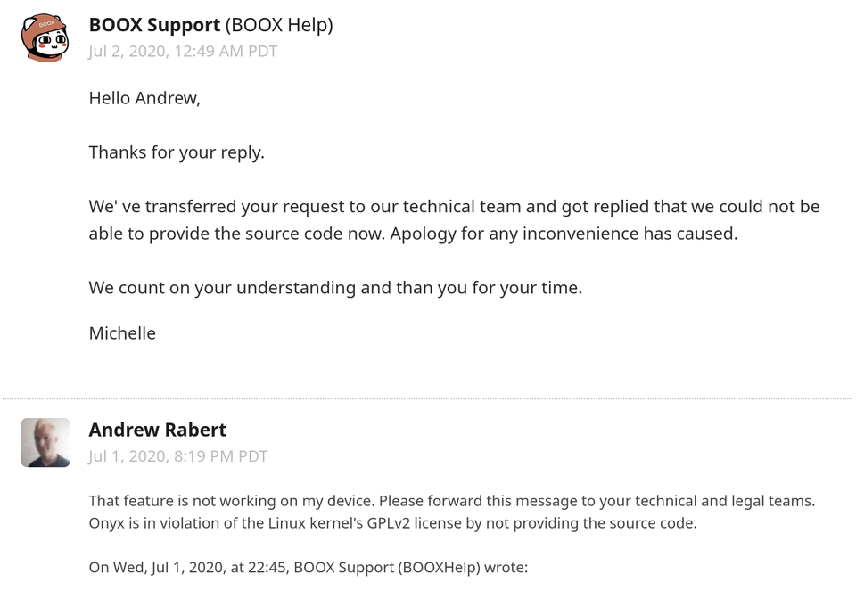
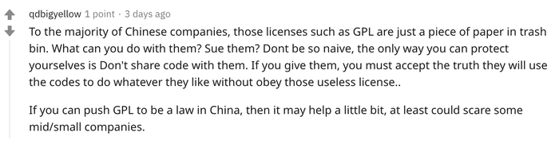
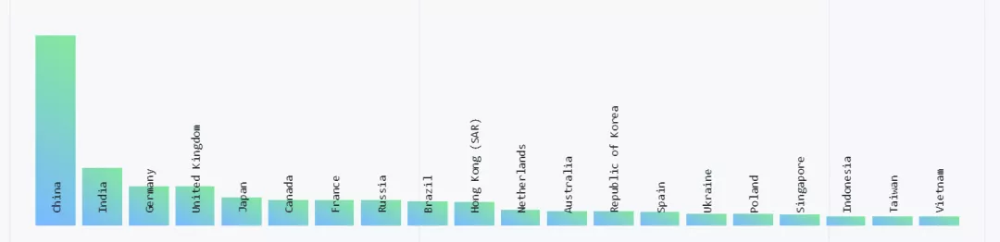
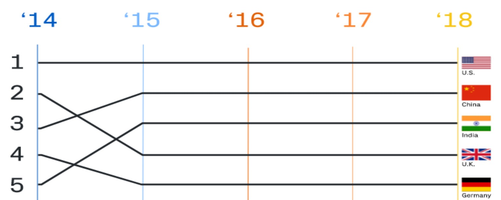
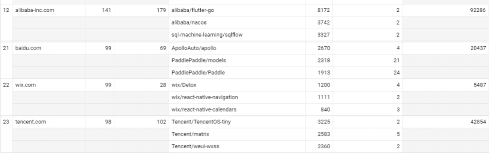
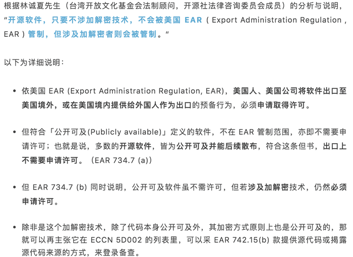
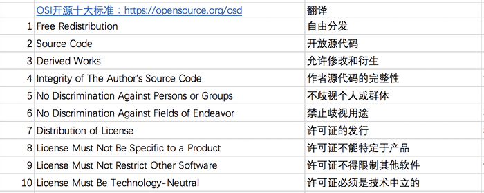
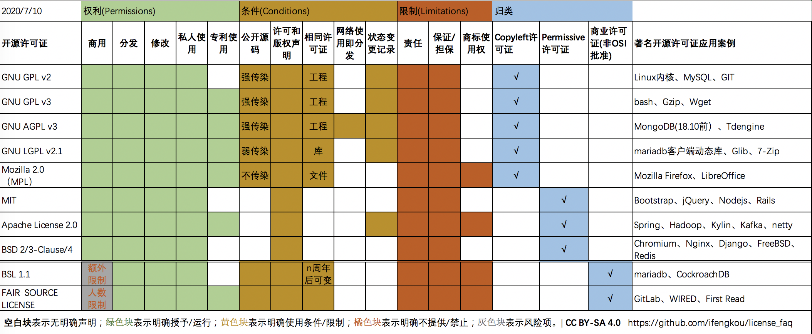

对于开源，我有好多好多问号？

大纲（暂定）

- 开源和版权意识
  - 题引
  - 中国开源现状
  - 版权意识现状
- 开源许可证
  - 版权、著作权概念（法律）
  - 什么是开源，开源的宗旨
  - 开源协议的组成和名词解释
  - 常见开源许可证对比（图和对比说明）
- FAQ
  - GPL
  - 商业化
  - 法律
  - 等等

章一

第一段 题引

最近 中国厂商 Oynx 拒发源码，被指违反 GPL 许可在国内外社交网络上被讨论的沸沸扬扬[]，缘由是Onyx 的电子书设备基于 Linux 内核修改发布的，而 Linux 内核基于 GPL v2 许可证发布，由于该许可证具备“传染性”，要求在进行二次分发时使用相同的许可证。根据 Reddit上的对话截图，有人向 Onyx 指出了其[违规问题](https://www.reddit.com/r/Onyx_Boox/comments/hk7d5v/onyx_is_violating_the_linux_kernels_license/)，而 Onyx 官方回应“技术团队表示目前不能把源码开放”，并希望他人谅解

Onyx事件在网络上引起广泛的讨论，有人表明绝不会购买Onyx产品，也有部分批评者认为Onyx事件暴露了中国厂商不尊重开源协议，质疑中国法律无法有效保障开源协议，“对于大多数中国公司而言，GPL 之类的许可证只是垃圾桶中的一张纸……保护自己的唯一方法就是不要与他们共享代码”

第二段 中国开源环境现状

虽然Onyx的态度令人气愤，但是网上的留言却非常不理性，实际上中国已经逐渐成为开源世界的最重要的玩家之一。根据全球最大代码托管平台 GitHub 在 2019 年发布的[年度报告](https://www.infoq.cn/article/bWhDOufOZrL7r3ZuBopy)中显示

2019年中国、印度和德国的开源使用速度加快。中国的开发者`forked`和`cloned`的项目比去年多48%。[]

2018年年度报告中显示，中国成为 GitHub 贡献排名第二的国家，排名仅次于美国[]

在网友根据push事件统计得出的2019年开源贡献度排行榜上 []，中国企业阿里贡献度排名第12、百度排名第21、腾讯排名第23，除了头部的大厂，也有越来越多的中小企业积极拥抱开源，并把自己的核心产品捐献给了一些知名开源基金会，例如大数据分析型数据库Kylin(Apache基金会)、分布式任务调度系统DolphinScheduler(Apache基金会)

第三段 许可证现状

随着开源环境越来越好，开发者和厂商对开源也越来越重视，国内的开发者正积极拥抱开源，但是还是有很多开发者对开源许可证权利限制问题还是不够重视

前两天，Apache孵化器项目DolphinScheduler的mentor(指导者)在审查代码时，发现有段外部开发者贡献的代码实际上是源于Oracle JDK，但该贡献者对该段代码进行重命名，并删除了原有的协议声明，替换为Apache License 协议。这段代码不过数百行，占整个工程代码几乎可以忽略不计，但这个行为却明确可定性为违约和侵犯著作权，若不是mentor 在发版前发现了这个问题并及时进行了回滚，分发出去的影响却是非常大的

从这个事件也反映很部分开发者对开源软件版权意识是非常淡薄的，也许是因为大部分开源许可证都是冗长的英文，以及类法律的行文风格，笔者自己从业十年，用过无数开源软件，也在github开源自己的软件，但是对许可证这个事情一无所知

前段时间MATLAB被禁止向哈工大等院校提供正版授权在网络上引发热议，MATLAB 所属公司 MathWorks 称因接到美国政府的进出口管制名单，无法继续为哈工大提供正版授权。依美国出口管制条例(简称EAR），美国人、美国公司将软件出口至美国境外，或在美国境内提供给外国人作为出口的预备行为，必须申请取得许可。但其中 符合`公开可及(Publicly available)`定义的软件，不在 EAR 管制范围，亦即不需要申请许可。也就是说开源软件，只要不涉非公开可及的加解密技术，不会被 EAR管制，这也就导致了当商业软件被管制后，开源软件的理念被重新讨论，开源软件价值也更加凸显，同时也推动中国厂商和开发者更加重视和尊重版权

随着更多的公司被加入BIS的实体清单，技术封锁的持续发酵，国内非常多的公司已经开始未雨绸缪，比如基础软件自研，或者在采购时就要求产品使用的技术或者中间件符合开源软件的条件，以此来规避风险；笔者所在的公司也对其商业项目也进行了license梳理，所有非开源的组件或使用了GPL协议的组件或代码被列为风险事项，立刻进行替换。

借此契机，笔者也对常用的开源许可证进行学习和梳理，现将这段时间自己收集和梳理的资料整理成文发布

章二

段一 基础： 版权、著作权概念

开源软件许可证与知识产权
著作权

1980 年，美国国会通过“96—517 号公法”，计算机程序被增加为著作权保护的对象之一。而后，《伯尔尼公约》、《与贸易有关的知识产权协议》、《世界知识产权组织版权条约》等国际公约均将计算机软件纳入版权的保护范围，各国立法也将计算机程序纳入著作权法的保护范围。在我国，《中华人民共和国著作权法》、《计算机软件保护条例》等均规定计算机软件是我国著作权法上的作品，开源软件本质上也是计算机软件，受到我国著作权法的保护。

根据《计算机软件保护条例》第 8 条规定，软件著作权人享有下列人身权利和财产权利：发表权；署名权； 修改权；复制权；发行权；出租权；信息网络传播权； 翻译权； 其他应当由软件著作权人享有的权利。许可他人行使其软件著作权，并有权获得报酬；全部或者部分转让其软件著作权，并有权获得报酬。

相较于传统计算机软件著作权，开源软件著作权的特殊性在于，开源软件著作权人通过许可协议的方式将部分著作权( 例如复制权，修改权、发行权) 无偿授予愿意接受许可证的人，让被许可人可以复制、修改、商业使用、再分发。虽然开源软件允许用户无偿自由使用，但这种行为并不是毫无限制的，用户必须在遵循许可协议的条件下使用开源软件，大部分开源许可证都明确规定，在修改源代码时，必须注明状态变更记录，并保留版权声明，不得侵犯作者的署名权和商标，而且为了避免著作权人后续遭遇法律诉讼，绝大部分开源许可证最后都会带上免责声明，表明软件是按 “AS IS”提供[]，拒绝提供任何担保（不论明示或暗示，包括但不限于针对特定目的的适销性和适用性的默示担保），也没有义务提供维护，支持，更新，增强或修改。

虽然开源软件许可证是以版权法或著作权法为基础，但开源许可证的法律效力并没有被明确认可，也就是说许可证既不是一种法律明文规定的权利，也不是一般意义上的合同（默认格式条款，双方无沟通或协商）。被许可人若违反许可证协议，首先成立违约行为，无需承担违约责任。在违约责任外，能否追诉违约者的著作权侵权责任却是困难重重，在实际案例中，美国Jacobsen v.Katzer 一案，德国Welte 诉 D-Link 一案均表明可以通过著作权侵权诉讼保护开源软件的权利，但是在中国，目前还没有特别明确的开源软件侵权诉讼案例

开源许可证在知识产权方面除了在著作权上体现显著，经常涉及到的还有专利权、商标权

专利权指如果开源软件中包含专利（包含隐形专利），那么许可人（及关联实体）是否明确表示提供专利许可，明确表示提供专利许可的有GPL、Apache、MPL等，也有无明确专利许可的MIT、BSD 3-clause License

商标权：该许可证明确声明不授予商标权，即使没有此类声明的许可证可能不授予任何隐含的商标权，几乎没有许可证明确声明授予商标使用

段二

什么是开源，开源的宗旨（开源组织的开源理念，osi fsf的宗旨），你为什么开源

从 1969 年美国IBM公司实行的计算机软件与硬件“价格分离”政策开始，软件商品化逐渐走进人们视野。软件著作权由此得以发展。但软件著作权在保护作者的同时，也阻断了全人类可以开放地对计算机软件程序进行自由研究和开发。为了打破源代码由程序员部分垄断的局面，1983 年，由理查德·马修·斯托曼( Richard Matthew Stallman) 启动 的“GUN”计划，提出了自由软件( Free Software) ，发起了开源运动的序幕，同年2月，创立和发布了GPL 许可证，GPL许可证承认原始作者的著作权，向公众提供源代码，并且允许公众进行复制，传播和再发布，修改和制作演绎作品，但要求任何基于 GPL 软件开发的衍生产品在发布时必须采用 GPL许可证方式，也就意味着必须公开其源代码。也许是因为GPL的“强传染性”（如果软件中微小一部分使用了GPL的代码，也要求整个软件公开所有源代码），自由软件数量非常小，GUN发展停滞不前。1998 年，艾瑞克·雷蒙德( Eric Raymond) 和布鲁·佩伦斯( Bruce Perens)等人 提出了用开放源代码软件( Open source software) 取代自由软件的提法，并成立开放源代码促进会（Open Source Initiative，缩写：OSI）[]。开源软件并不再局限于“强传染性”的 GPL 许可证，而是在保证软件源代码开放的同时，允许权利人自行设计许可证并且由 OSI 组织加以审核认证。目前所有被OSI批准的许可证已有上百种，除了有GNU GPL、LGPL等协议，大名鼎鼎的Apache License、BSD、MIT、CDDL等协议都在其中，还有由北京大学牵头起草的中英文表述的木兰宽松许可证MulanPSL-2.0

开源软件(**open source software，简称OSS**)区别于专有软件、闭源商业软件， 开源软件是指向社会公众开放软件源代码，软件的著作权人保留一部分权利，允许代码获得者可以依据不同许可证的授权方式在源代码基础上自由使用、修改并允许再发布的软件。

如果只是将源码公开，没有相应的权利许可，或者是作者设置了自由使用的条件限制，例如禁止商用和限制派生产品的Discuz，限制用户数的Gitlab，这些软件均不能被称之为开源软件。在软件行业，一般认为开源软件对应的是使用通过OSI 组织批准的许可证协议的软件

《大教堂与集市》的译者卫剑钒在开源社举办的中国开源年会COSCon'19上总结了开源软件的7大理念 ：完全自主、高度开放、自发自治、自下而上、自由竞争、赢在声誉、社区赋能[]，这些开源理念非常易于被广大软件开发者接纳和拥戴，开源产品如雨后春笋般涌现。自2017年11月起，所有列出的Top500超级计算机都使用基于Linux内核的操作系统[];全世界Top1000万个网站有70%使用的是开源的web服务器[]。在软件各个领域中都有广为人知的开源明星，操作系统有Linux、Android，数据库有Mysql、PostgreSQL、MongoDb、Redis，大数据平台有Hadoop、ElasticSearch、Spark，Web服务器有Tomcat、Apache、Nginx、Node.js，虚拟化有KVM、Docker、Kubernetes，人工智能有Tensorflow、Scikit-learn。开源软件已经成为互联网发展，软件发展不可缺少的一部分。

段三

经过OSI批准的开源许可证有上百种，经过OSI根据数据统计的最广泛使用的许可证有Apache许可证、BSD2/3许可证、GPL系列、MIT许可证、MPL、CDDL、EPL，那么如何选择开源许可证，或者在使用或分发开源项目时候需要注意的风险呢？

开源许可证在使用宽松程度上，普遍被分为两类，一个是以GPL为代表的Copyleft许可证(Copyright反义词，反版权），一个是对用户没有限制相对较少的宽松式许可证（Permissive license）

在近几年有很多开源的软件，由于云厂商对开源软件的侵入，越来越多的开源软件选择变更原先的开源许可，转向了商业许可证或者自定义社区许可证，如BSL(Bussiness source license )，其中案例有mariadb、CockroachDB等等。所以这次对比在最后增加两个无法通过OSI批准的商业类型许可证

近几年有很多开源的软件，由于云厂商对开源软件的侵入，选择变更原先的开源许可，转向了商业限制许可证或者自定义社区许可证(如mariadb新创的BSL(Bussiness source license )协议、mongodb新创SSPL协议)，变更许可证案例有Elastic、Confluent、MongoDB、Redis等等。所以针对这一现象，在最后增加两个商业限制开源许可证一同进行对比分析

一份开源协议一般会由这3个方面组成，赋予哪些权利、承担的约束限制及责任说明，每个方面又有几个具体的项：

权利方面主要有：商用、分发、修改、私人使用、专利使用

约束方面主要有：是否需要公开源代码、是否需要保留版权声明、是否需要用相同的许可证分发、网络交互服务是否算分发、是否保留变更记录

限制方面主要有：免责声明、不提供任何保证、是否允许使用商标

**图中的传染性指什么？**

传染性来源于GPL，GPL的支持者确信自由软件世界应具有自我保护能力和可持续发展性——为了确保自由软件的演绎作品同样“自由”，所以要求只要使用了GPL的代码，那么整个项目都必须以GPL方式公开源代码

LGPL 在这方面要求就没GPL那么严格，如果只是子系统/模块用了，那么只需要子系统/模块开源，整个工程不用开源；如果是以动态链接调用LGPL许可证的库，那么项目也不用开源。

MPL 在这个方面就更宽松，哪个文件用了该许可证的代码，只需要这些文件开源即可，其他文件不受影响

所以，GPL v2/v3、AGPL 属于工程级别的强传染性；LGPL属于库级别的若传染性；MPL 就是文件级别的，传染性可以忽略不计了

**图中的分发指什么？**[]

许可证授予的权利，允许你自由使用、修改、复制，但是在“分发”时就必须遵守许可证的约束。换言之，如果不"分发"，就不需要遵守。

分发就是指将版权作品从一个人转移到另一个人。这意味着，如果你是自己使用，不提供给他人，就没有分发。另外，这里的"人"也指"法人"，因此如果使用方是公司，且只在公司内部使用，也不需要遵守许可证。

其中AGPL有个特例：AGPL定义，如果你使用开源软件提供网络交互服务，那么该行为也定义为“分发”，即图中的“网络使用即分发”

**为什么有这么多GPL，他们的差异是？**

AGPL 和 GPL 的区别：

AGPL修复GPL 2.0/3.0关于漏洞：比如使用GPL的自由软件，但是并不发布与网络之中，则可以自由的使用GPL协议确不开源自己私有的解决方案。AGPL则增加了对此做法的约束。比如使用了AGPL代码的软件是一个网络应用，那么这个软件的所有源码和修改代码也必须开源

GPL v2 和 GPL v3的主要差异：
   a) GPLv3包含了明确的专利许可

   b) 添加了对数字版权管理和加密签名的限制，不仅要求用户公开源码，还要求公布相关硬件及必要的安装信息。

GPL 和LGPL的区别：

主要区别在于传染性方面，GPL是工程级别的强传染，LGPL是库级别的弱传染

**商业开源许可证是什么？**

什么是商业来源许可证（BSL）Business  Source License 

BSL是封闭源或开放核心许可模式的新替代品。在BSL中，源代码始终是免费提供的，并且可以保证在特定时间点（即更改日期）成为开源。在BSL中低于特定级别的使用始终是完全免费的。超过指定级别（高级用户）的使用需要更改日期之前的供应商许可证，此时所有使用将变为免费

高低级别一般会根据软件特性有权利人自己定义，比如在mariadb数据库中，最多只能免费使用2个数据库实例，如果超过了2个数据库实例，那么需要向权利人购买高级别的商业版权。

很多从开源许可证 转变为商业许可证的软件，也是希望避免变云服务提供商侵蚀利益，保证自己的商业收入

**BSL 和 FAIR 协议的区别：**

在商用上，BSL会根据产品特性自由指定限制项，而FAIR限定项特指用户数，FAIR20表示限定20个用户免费使用，FAIR50 指限定50个用户免费使用。超过限制规定，则需要购买商业版权

另外BSL 有 在特定日期 变更为 其他开源许可证的特性。

**BSL与GPL  /商业双重许可有何不同？**

在GPL中使用双重许可时，公司必须支付商业许可才能使用其封闭源代码使用该软件。使用BSL，公司仅在想要使用超出免费使用限制的软件时才付费。

本文采用 [CC BY-NC-SA 4.0](https://creativecommons.org/licenses/by-nc-sa/4.0/deed.zh) 许可协议

------ 待整理

章三

常见问答

> 我可否使用GPL下的编辑器，比如GNU  Emacs，开发非自由软件？我可否使用GPL下的工具，比如GCC，编译非自由软件
>
> 是的，因为编辑器和工具的版权并不包括你编写的代码。从法律上说，使用这些工具并不对你代码的许可证带来任何限制。

GPL

java使用的开源协议是gplv2  ，那岂不是用java开发出来的各种网站,工具,只要你发布到了网上 我是不是都可以理解为需要提供源码? 

“使用”和“基于其开发”是两个不同的概念。你可以“使用”，但是不能包装它，然后当做独立产品发布。如果你把JAVA的源码编译一下，改个名字发布JAVAX语言，那么你是需要开源的。

当我通过JDBC 方式（MySQL Connector/J JDBC驱动程序）使用了基于GPL的mysql 是否程序也需要开源

使用mysql 不受gpl限制，使用了Mysql作为数据库，只能说是使用/ 输出，但是MySQL Connector/J 驱动也是GPL的，所以是需要开源，或者每年订阅MySQL Network的服务 或者向oracle 申请商业授权（除非你不分发内部用，或者你的程序是FOSS （开源软件例外）

在AGPLv3中，什么应该算作是“通过计算机网络和[该软件]远程交互？”

如果程序的设计明显是通过网络接受用户请求和发送回复，那么该程序就符合远程交互的判定条件。符合此类条件的常见程序包括网络服务器和邮件服务器、交互式网络应用程序以及在线游戏的服务器。

引用：

- onyx事件https://www.reddit.com/r/Onyx_Boox/comments/hk7d5v/onyx_is_violating_the_linux_kernels_license/
- 2019中国开源报告https://github.com/kaiyuanshe/2019-China-Open-Source-Report/blob/master/insight.md
- 2019 GitHub 开源贡献排行榜https://mp.weixin.qq.com/s/_q812aGD1b9QvZ2WFI0Qgw
- matlap事件https://www.oschina.net/news/116379/matlab-ban-and-edu-schools
- 专家解读：开源软件项目是否会被限制出口?https://mp.weixin.qq.com/s/_wmBHskWi5CCTjDWu6fMAg
- 中华人民共和国著作权法 https://www.wipo.int/edocs/lexdocs/laws/zh/cn/cn031zh.pdf
- 世界版权公约[https://zh.wikipedia.org/wiki/%E4%B8%96%E7%95%8C%E7%89%88%E6%9D%83%E5%85%AC%E7%BA%A6](https://zh.wikipedia.org/wiki/世界版权公约)
- 伯尔尼公约[https://zh.wikipedia.org/wiki/%E4%BC%AF%E5%B0%94%E5%B0%BC%E4%BF%9D%E6%8A%A4%E6%96%87%E5%AD%A6%E5%92%8C%E8%89%BA%E6%9C%AF%E4%BD%9C%E5%93%81%E5%85%AC%E7%BA%A6](https://zh.wikipedia.org/wiki/伯尔尼保护文学和艺术作品公约)
- "AS IS" 术语 https://en.wikipedia.org/wiki/As_is
- GPL FAQ  https://www.gnu.org/licenses/gpl-faq.html
- 论开源软件的著作权风险及相应对策 http://fxy.buaa.edu.cn/kaiyuanxiaojianhua.pdf
- 开源软件wiki https://zh.wikipedia.org/wiki/%E5%BC%80%E6%BA%90%E8%BD%AF%E4%BB%B6
- **TOP500**最强计算机https://zh.wikipedia.org/wiki/TOP500
- Apache 和Nginx 市场份额：https://en.wikipedia.org/wiki/Apache_HTTP_Server
- OSI  https://opensource.org/licenses/alphabetical
- 木兰许可证 https://license.coscl.org.cn/MulanPSL2/index.html
- 开源的7大理念https://mp.weixin.qq.com/s/15kCZNCG1psxyWv0WfOHAw
- 阮一峰 开源许可证教程https://www.ruanyifeng.com/blog/2017/10/open-source-license-tutorial.html