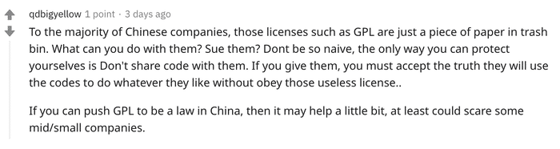

# 开源许可证和知识产权

http://crva.ict.ac.cn/documents/A-Report-on-the-Risks-and-Suggestions-of-Open-Source-Projects.pdf

增加这个相关的内容

### 中国厂商 Oynx 违反GPL协议?

最近 中国厂商 Oynx 拒发源码，被指违反 GPL 许可在国内外社交网络上被讨论的沸沸扬扬，缘由是Onyx 的电子书设备基于 Linux 内核修改发布的，而 Linux 内核基于 GPL v2 许可证发布，由于该许可证具备“传染性”，要求在进行二次分发时使用相同的许可证。根据 Reddit上的对话截图，有人向 Onyx 指出了其违规问题，而 Onyx 官方回应“技术团队表示目前不能把源码开放”，并希望他人谅解[1]

Onyx事件在网络上引起广泛的讨论，有人表明绝不会购买Onyx产品，也有部分批评者认为Onyx事件暴露了中国厂商不尊重开源协议，质疑中国法律无法有效保障开源协议，“对于大多数中国公司而言，GPL 之类的许可证只是垃圾桶中的一张纸……保护自己的唯一方法就是不要与他们共享代码”

开源软件虽说对外开放了源代码，但是用户在使用、修改、再发布时，必须要遵守软件附带许可证中定义的授权条款。开源许可证是一种具有法律性质的合同/合约，目的在于规范受著作权保护的软件的使用或者分发行为。许可证一般位于软件工程目录的LICENSE文件、和所有源码文件最前面的CopyRight声明。

随着开源软件在国内外蓬勃发展，开源许可证的种类激增，仅OSI(一个非赢利性开源组织) 认证的许可证就有上百个，每个许可证对权利和约束的规定又各不相同，而且几乎都是冗长的类法律风格的英文版，阅读和理解起来十分困难。再加上我国尚未发生过与开源软件许可证有关的诉讼，导致广大开发者对开源和开源许可证的认知存在明显的不足，软件合规的风险意识欠缺。

开源许可证本质上是一份合同，开源软件本质上是一份由作者创作的作品，受知识产权中的著作权法保护。如果违反了许可证的规定，很可能就构成了合同违约和知识产权侵权

## 开源许可证和合同法

在各国法律中，开源许可证的法律性质存在一定的差异。

在美国，合同和许可是有所区分的。如果是合同，那么需要适用各州不同的合同法；如果是许可，那么需要适用统一的联邦版权法。而开源软件许可证性质上到底是属于合同还是许可还存在一定争议。美国法律规定合同需要当事人达成合意才具有可执行性。但开源许可证并非一般意义上的合同，许可证采用默认格式条款，并且被许可人也没有进行过任何明示的承诺。但从实际诉讼案例来看，普遍倾向于开源许可证也构成合同，受合同法约束。

在我国，许可证是符合合同的定义[4]。

> 合同法第十三条表示可以通过要约签订合同；第十五条表示寄送的价目表、拍卖公告、招标公告、招股说明书甚至符合要约规定的商业广告均视为要约邀请(非原文)。
>
> 合同法第三十九条也明确表示支持采用格式条款订立合同(非原文)

权利人释放出附带许可证的开源代码相当于发出要约，而使用者使用开源代码相当于用行动表示承诺，双方的许可合同成立并生效。所以许可证在国内是被视为是许可人与被许可人之间的合同。

当被许可人在违反许可证设定的义务时构成合同违约。同时，根据具体情况还可能构成著作权侵权。在我国，**侵权责任和违约责任不能同时主张**。我国合同法第122条规定，在违约与侵权构成责任竞合时，当事人需**择一地主张权利**。但是在美国，却可以同时主张合同违约和版权侵犯。

再次强调的是，我国过往的判例都没有涉及开源软件许可证本身。

## 开源许可证和知识产权

一份开源软件许可证在知识产权上主要体现在这3个方面： 著作权、专利权、商标权

### 许可证和著作权

我国对计算机软件著作权保护的法律条款主要是《中华人民共和国著作权法》[5]、《计算机软件保护条例》。根据《计算机软件保护条例》第 8 条规定[6]：

> 软件著作权人享有下列人身权利和财产权利：发表权；署名权； 修改权；复制权；发行权；出租权；信息网络传播权； 翻译权； 其他应当由软件著作权人享有的权利。许可他人行使其软件著作权，并有权获得报酬；全部或者部分转让其软件著作权，并有权获得报酬。

而对于计算机软件的著作权的跨国保护，主要依赖于著作权保护（不限于计算机软件）的国际条约《保护文学和艺术作品伯尔尼公约》，简称伯尔尼公约[7]。该公约规定成员国公民的作者，任何一成员国首次发表其作品的作者，其作品在其他成员国应受到保护，此种保护应与各国给予本国国民的作品的保护相同。该公约目前有179个缔约国，中国于1992年正式成为伯尔尼公约成员国。

开源软件本质上也是计算机软件，受到各国著作权法和国际公约的保护。但相较于传统计算机软件著作权，开源软件著作权的特殊性在于，**开源软件著作权人通过许可协议的方式将部分著作权( 例如复制权，修改权、发行权) 无偿授予愿意接受许可证的人**，让被许可人可以复制、修改、商业使用、再分发。虽然开源软件允许用户无偿自由使用，但**用户必须在遵循许可协议的条件下使用和分发开源软件**。大部分开源许可证都明确规定，在修改源代码时，必须注明状态变更记录，并保留版权声明，不得侵犯作者的署名权和商标。

### 许可证和专利权、商标权

开源许可证在知识产权方面除了在著作权上体现显著，经常涉及到的还有专利权许可、商标权的许可。许可证中的专利权指如果软件中包含专利（包含隐形专利），那么许可人（及关联实体）是否明确表示提供专利许可。如果被许可人或关联实体对许可软件发起专利诉讼，那么专利许可终止。开源许可证中明确表示提供专利许可的许可证有GPL、Apache、MPL、木兰许可证等，无明确专利许可的有MIT、BSD 3-clause License等。

对于商标权，几乎没有许可证明确声明授予商标使用许可，MPL、Apache、BSD 3-clause License等协议明确声明禁止其他人未经书面许可而使用项目名称或其贡献者来推广衍生产品；其他没有此类声明的许可证，默认是不提供商标的使用权。

国际上对于专利权、商标权的保护主要依赖于国际条约《保护工业产权巴黎公约》，巴黎公约目前有177个缔约国，中国于1985年成为巴黎公约成员国。

###  违反许可证的法律风险

在许可证和合同章节有说明，被许可人在违反许可证设定的义务时会构成合同违约，但是否构成著作权侵权，还需要根据情况而定。虽然开源软件本质上属于计算机软件，著作权法或版权法都是为了保护著作权人权益，但是开源许可证本质却是走在了保护版权的对立面，而且像GPL类型的许可证中还包含与被许可人将派生作品开源并受GPL约束的特定义务（版权法描述属于“额外的要素”），在约束的边界上也存在这不确定性，所以当违反了开源许可证中约束时，是否侵权并无明确定义，需要根据法院实际情况而定，目前行业内对开源许可证合同违约和知识产权侵权风险的认知更多的是来源于对一些国内外关于开源的真实事件和诉讼案例解读。

## 案例

### 美国Artifex 诉韩国公司Hancom案

在2016年12月美国Artifex 诉韩国公司Hancom诉讼案，Artifex的投诉称Hancom将PDF解释器Ghostscript整合到自己的专有软件Hancom Office中，而没有遵循GNU GPL的条款公开源代码或支付例外费用(Ghostscript为双重许可证）[9]。

原告Artifex提出两项救济要求：

> **1.合同违约**；**2.侵犯版权；**。原告寻求**永久禁止令**，要求被告禁止进一步使用Ghostscript使用任何产品，禁止被告直接或间接侵权。并**要求Hangul和Hancom Office根据GNU GPL提供了产品的完整源代码** 以及 **寻求赔偿** ，间接性，法定性和示范性损害赔偿，以及 律师' 的费用和成本[9]

被告对申诉作出回应，提出了驳回(撤销案件)的基本议案：

> 首先，原告未能提出**违反合同**的索赔，而任何此类索赔均受版权法的约束。 其次，必须驳回原告的版权主张，部分原因是原告未能指控被告**在美国**实施了上游行为。 最后，被告人采取行动，要求部分减免。[9]

Hancom提出撤销案件的动议后续被法院一一驳回；Hancom在后续的初始案件管理会议上就合同索赔提出简易判决环节的动议[10]：

> 首先，被告认为，原告因违反合同要求而寻求的金钱救济是不适当的，因为从本质上讲，原告因违反GPL合同而无法追偿的金额超过其履行履约的费用，并且由于许可证是免费的，因此不存在任何损害赔偿。 其次，被告坚持认为，即使存在损害赔偿，被告会在2008年3月10日终止（Hancom发布其产品的第一天，即不遵守开源要求，合同也就终止了）。

法院也拒绝这些动议。最终在2017年年底，双方达成庭外和解。虽然案件因为和解并没有进行最终的审判阶段，但在之前的动议和诉求的驳回中，可以看到关于开源许可证的非常有意义和价值的参考：

1. Hancom公司动议：**主张 GNU GPL许可证并不构成合同，因为被告从未签署过，双方未达成合意，因此不存在合同关系**。动议被法院**驳回**案件继续审理。（许可证规定：如果用户使用Ghostscript软件而不购买商业许可证，则该用户默认接受GPL的条款。）
2. Hancom动议：原告**不能针对被告在美国境外的侵权行为根据美国版权法提起诉讼**。动议被法院**驳回**，并认为 *“至少有一些侵权行为是在美国发生的”并且“美国的行为与境外侵权之间存在必要的联系”*
3. Hancom动议：Hancom辩称由于**根据GPL不收取任何费用，因此违反GPL不会造成金钱损失**；法院指出: *尽管不能将商业许可的条款强加给Hancom，但“**陪审团可以将商业许可的价值作为确定损害赔偿的依据**。”*
4. Hancom动议：Hancom辩称如果允许任何合同索赔，则应仅在初次违反之日之前考虑损害赔偿。他们争辩说，**由于违反行为终止了他们的许可，因此合同也于那时终止**。法官指出：*被告的义务在其使用Ghostscript传播软件的权利终止后仍然存在... ...因为每次传达“被掩盖的作品”时，被告每次分发“被发现的作品”时都需要源代码或源代码的提供*
5. Artifex诉求：根据GPL许可证要求，**要求被许可人在分发GPL衍生作品时需要开放源代码**。法院未就此问题做出最终裁决，但**法院明确拒绝驳回Artifex的此类命令请求**。法院指出，只有在无法计算赔偿金或赔偿金不切实际且“最终施加这种救济极其可疑”的情况下，此类命令才是适当的[11]。

### MongoDB变更开源许可协议案例

MongoDB之前是采用双重许可证模式，商业版采用商业许可证，社区服务器版本采用开源许可协议AGPLv3。2018年10月，MongoDB宣布其开源许可证从AGPLv3变更为Server Side Public License(简称SSPL) ，其后发布的所有的社区服务器版本及补丁(含旧版本补丁)都使用SSPL协议[12]。

SSPL 许可协议是基于GPL v3修改产生的，主要差异在于：任何人都可以以提供技术服务为目的，运行私有修改的GPL许可的程序，只要不进行分发，就不需要开源。AGPL对此进行了一个补充：如果其许可的程序与用户通过网络进行远程交互，那么也需要提供源代码。按理来说，AGPL 将提供网络交互使用这一情况也纳入分发的范围，但是由于AGPLv3许可协议的规定的不明确性，导致很多企业一直在试探AGPL的边界。AGPLv3第13条虽然规定了“远程网络交互”的限制条件。但是业界对于“远程网络交互”的触发条件以及范围存在争议。因此SSPL明确规定了将程序或程序的修改版本作为服务向第三方提供的条件限制[13]：

> 如果您将某程序的功能或者修改后的版本作为一项服务提供给第三方，必须按照本许可证的条款，通过网络下载向所有人免费提供服务源代码。
>
> “服务源代码”是指本程序或经修改的版本的相应源，以及您用于使本程序或经修改的版本作为服务可用的所有程序的相应源，包括但不限于管理软件，用户界面，应用程序界面，自动化软件，监视软件，备份软件，存储软件和托管软件，所有这些使用户可以使用您提供的服务源代码运行服务实例。

SSPL限制的最典型场景是云平台将开源软件托管产品打包成服务对外售卖。MongoDB更换协议后，云厂商如果想销售基于MongoDB的云服务，要么完全公开其服务源代码，要么就需要购买商业许可证。条款中对需要公开的`服务源代码`的定义非常广泛，包括管理软件、用户界面、应用程序界面、自动化软件、监视软件、备份软件、存储软件和托管软件，云服务厂商如果将这些源代码公开，那么将丧失提供差异化云服务的能力[14]。

各大云平台针对MongoDB更换协议事件，处理方式各不相同。阿里云与MongoDB 签订合作协议取得MongoDB-as-a-service的授权，继续为用户提供MongoDB云服务[15] 。国内另一家云厂商腾讯云采用另一种方式，基于 MongoDB 推出CMONGO（TencentDB for MongoDB），该数据库100% 完全兼容 MongoDB 协议。国外的三大云厂商AWS、微软、Google 均是和腾讯云一样模式推出类似MongoDB的替代品

### 案例总结

从案例可以看出由于开源软件和开源许可证的特殊性，以及许可证中包含的约束条件在边界上还存在不确定性，开源许可证的法律效力并没有被明确认可，要维护维护开源软件著作权人的权利，追诉违约者的违约责任和侵权责任还是存在一定的难度。虽然开源许可证的法律效力未明确定义，但若对许可证中的授权条款随意违约，会存在被诉讼的风险，且较大概率会被认定违约和侵权。

除了面临法律诉讼风险，违反许可证的行为会导致自由软件者和开源社区的排斥，某种程度上会影响违约公司的商业信誉。在Oynx 违反GPL协议的帖子下，虽然事件尚未定性，但已经有非常多人留言表示不会购买Oynx生产的任何设备，已购买的用户甚至希望用退货来表达对Oynx厂商不尊重开源精神的不满。在MongoDB变更协议后，国内云厂商也不敢明目张胆地违反许可证，也侧方面证明不管是道德上还是法律上，开源许可证是存在一定的约束力的

## 如何规避许可证违约和侵权风险

1.提升开发团队的合规意识，对开源软件的合规风险进行教育

2.确保商业产品中不会被违规嵌入开源软件。由于GPL这类型强传染性的许可证要求其衍生产品也完全公开，一般需要删除GPL的代码或组件，重写或者替换

3.采购软件或委托开发时，可以要求列出所使用的开源软件以及将开源软件的合规性要求写入合同中

## 引用：

1. onyx事件https://www.reddit.com/r/Onyx_Boox/comments/hk7d5v/onyx_is_violating_the_linux_kernels_license/
2. **TOP500**最强计算机https://zh.wikipedia.org/wiki/TOP500
3. Apache 和Nginx 市场份额：https://en.wikipedia.org/wiki/Apache_HTTP_Server
4. 中华人民共和国合同法 http://www.gov.cn/banshi/2005-07/11/content_13695.htm
5. 中华人民共和国著作权法 https://www.wipo.int/edocs/lexdocs/laws/zh/cn/cn031zh.pdf
6. 计算机保护条例 http://www.gov.cn/zwgk/2013-02/08/content_2330130.htm
7. 国家知识产权 -伯尔尼公约 http://www.cnipa.gov.cn/zcfg/gjty/1063150.htm
8. 保护工业产权巴黎公约 http://tfs.mofcom.gov.cn/article/date/j/an/200212/20021200058450.shtml
9. Artifex诉Hancom 法院案件记录1 https://cases.justia.com/federal/district-courts/california/candce/3:2016cv06982/305835/32/0.pdf
10. Artifex诉Hancom 法院案件记录2https://cases.justia.com/federal/district-courts/california/candce/3:2016cv06982/305835/54/0.pdf
11. Artifex诉Hancom:违反GPL是否违反合同 https://www.synopsys.com/blogs/software-security/breach-gpl-license-breach-contract/
12. 面对云厂商插管吸血，MongoDB使出绝杀https://mp.weixin.qq.com/s/cARmFhaV2KTd1_16N5MsGA
13. SSPL协议 https://www.mongodb.com/licensing/server-side-public-license
14. MongoDB案例部分摘录于中国信息通信研究院http://www.caict.ac.cn/kxyj/qwfb/bps/201907/P020190710343670915282.pdf
15. MongoDB授权阿里云为客户提供 MongoDB-as-a-servicehttps://www.infoq.cn/article/zUYlBgZeEvuDH4cajArV
16. matlap事件https://www.oschina.net/news/116379/matlab-ban-and-edu-schools
17. 开源社：专家解读：开源软件项目是否会被限制出口?https://mp.weixin.qq.com/s/_wmBHskWi5CCTjDWu6fMAg
18. GPL FAQ  https://www.gnu.org/licenses/gpl-faq.html
19. OpenSource FAQ https://opensource.org/faq

