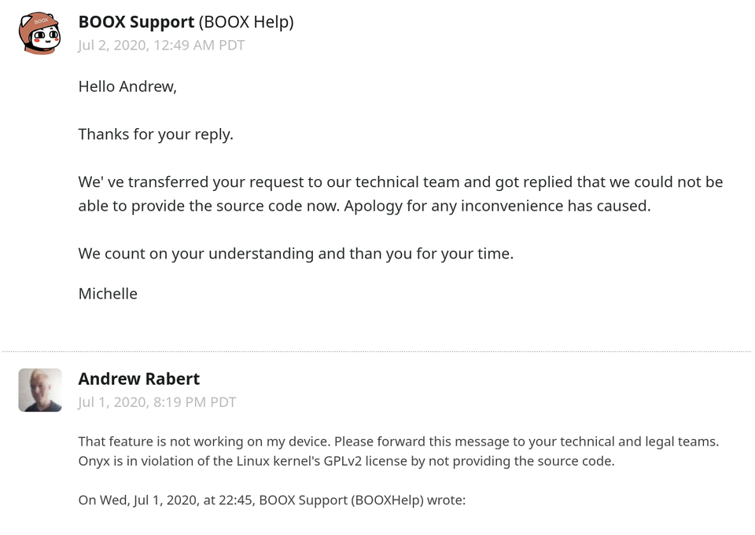

# 开源许可证和知识产权

### 中国厂商 Oynx 违反GPL协议

最近 中国厂商 Oynx 拒发源码，被指违反 GPL 许可在国内外社交网络上被讨论的沸沸扬扬[]，缘由是Onyx 的电子书设备基于 Linux 内核修改发布的，而 Linux 内核基于 GPL v2 许可证发布，由于该许可证具备“传染性”，要求在进行二次分发时使用相同的许可证。根据 Reddit上的对话截图，有人向 Onyx 指出了其违规问题，而 Onyx 官方回应“技术团队表示目前不能把源码开放”，并希望他人谅解

Onyx事件在网络上引起广泛的讨论，有人表明绝不会购买Onyx产品，也有部分批评者认为Onyx事件暴露了中国厂商不尊重开源协议，质疑中国法律无法有效保障开源协议，“对于大多数中国公司而言，GPL 之类的许可证只是垃圾桶中的一张纸……保护自己的唯一方法就是不要与他们共享代码”

随着开源环境越来越好，国内的开发者和厂商也正积极拥抱开源，早在2018年中国就成为开源贡献排行榜榜首位置，开源的使用人数、fork的项目数也是排名前2，但是还是有很多开发者对开源许可证权利限制问题还是不够重视

前两天，Apache孵化器项目DolphinScheduler的mentor(指导者)在审查代码时，发现有段外部开发者贡献的代码实际上是源于Oracle JDK，但该贡献者对该段代码进行重命名，并删除了原有的协议声明，替换为Apache License 协议。这段代码不过数百行，占整个工程代码几乎可以忽略不计，但这个行为却明确可定性为违约和侵犯著作权，若不是mentor 在发版前发现了这个问题并及时进行了回滚，分发出去的影响却是非常大的

从这个事件也反映很部分开发者对开源软件版权意识是非常淡薄的，也许是因为大部分开源许可证都是冗长的英文，以及类法律的行文风格，笔者自己从业十年，用过无数开源软件，也在github开源自己的软件，但是对许可证这个事情一无所知

### 美国出口管制条例和开源软件

前段时间MATLAB被禁止向哈工大等院校提供正版授权在网络上引发热议，MATLAB 所属公司 MathWorks 称因接到美国政府的进出口管制名单，无法继续为哈工大提供正版授权。依美国出口管制条例(简称EAR），美国人、美国公司将软件出口至美国境外，或在美国境内提供给外国人作为出口的预备行为，必须申请取得许可。但其中 符合`公开可及(Publicly available)`定义的软件，不在 EAR 管制范围，亦即不需要申请许可。也就是说开源软件，只要不涉非公开可及的加解密技术，不会被 EAR管制，这也就导致了当商业软件被管制后，开源软件的理念被重新讨论，开源软件价值也更加凸显，同时也推动中国厂商和开发者更加重视和尊重版权

随着更多的公司被加入BIS的实体清单，技术封锁的持续发酵，国内非常多的公司已经开始未雨绸缪，比如基础软件自研，或者在采购时就要求产品使用的技术或者中间件符合开源软件的条件，以此来规避风险；笔者所在的公司也对其商业项目也进行了license梳理，所有非开源的组件或使用了GPL协议的组件或代码被列为风险事项，立刻进行替换。

借此契机，笔者也对常用的开源许可证进行学习和梳理，现将这段时间自己收集和梳理的资料整理成文发布

## 开源软件许可证和知识产权

一份开源软件许可证在知识产权上主要体现在这3个方面： 著作权、专利权、商标权

我国对计算机软件著作权保护的法律条款主要是《中华人民共和国著作权法》、《计算机软件保护条例》。根据《计算机软件保护条例》第 8 条规定，软件著作权人享有下列人身权利和财产权利：发表权；署名权； 修改权；复制权；发行权；出租权；信息网络传播权； 翻译权； 其他应当由软件著作权人享有的权利。许可他人行使其软件著作权，并有权获得报酬；全部或者部分转让其软件著作权，并有权获得报酬。

而对于计算机软件的著作权的跨国保护，主要依赖于著作权保护（不限于计算机软件）的国际条约《保护文学和艺术作品伯尔尼公约》，简称伯尔尼公约。该公约规定成员国公民的作者，任何一成员国首次发表其作品的作者，其作品在其他成员国应受到保护，此种保护应与各国给予本国国民的作品的保护相同。该公约目前有179个缔约国，中国于1992年正式成为伯尔尼公约成员国。

开源软件本质上也是计算机软件，受到各国著作权法和国际公约的保护。但相较于传统计算机软件著作权，开源软件著作权的特殊性在于，开源软件著作权人通过许可协议的方式将部分著作权( 例如复制权，修改权、发行权) 无偿授予愿意接受许可证的人，让被许可人可以复制、修改、商业使用、再分发。虽然开源软件允许用户无偿自由使用，但用户必须在遵循许可协议的条件下使用和分发开源软件。大部分开源许可证都明确规定，在修改源代码时，必须注明状态变更记录，并保留版权声明，不得侵犯作者的署名权和商标。

开源许可证在知识产权方面除了在著作权上体现显著，经常涉及到的还有专利权、商标权。许可证中的专利权指如果软件中包含专利（包含隐形专利），那么许可人（及关联实体）是否明确表示提供专利许可。明确表示提供专利许可的许可证有GPL、Apache、MPL等，无明确专利许可的有MIT、BSD 3-clause License。对于商标权：几乎没有许可证明确声明授予商标使用，MPL、Apache协议明确声明不授予商标权，其他没有此类声明的许可证，默认也是不提供商标的使用权。国际上对于专利、商标权的保护主要依赖于国际条约《保护工业产权巴黎公约》，巴黎公约目前有177个缔约国，中国于1985年成为巴黎公约成员国。

【无法衔接，上面说保护，下面说法律上不承认】

虽然开源软件也受知识产权相关法律保护，但是开源软件许可证的约定的权利并不是一种法律上明文规定的权利，也不是一般意义上的合同（默认格式条款，双方无沟通或协商），被许可人若违反许可证协议，是否需承担违约责任和侵权责任？

在2017年美国Artifex 诉韩国公司Hancom诉讼案，Artifex的投诉称Hancom将Ghostscript整合到自己的专有软件中，而没有遵循GNU GPL的条款或支付例外费用(双重许可证）。在Artifex的诉讼中，基于Hancom收录的Ghostscript提出两项指控：（1）侵犯版权；（2）基于GPL的合同违约。Hancom提出了驳回此案的动议(驳回动议不代表裁定事实，动议被驳回案件继续审理)[]

1. Hancom 主张 GNU GPL许可证并不构成合同，因为被告从未签署过，双方未达成合意，因此不存在合同关系
2. 由于根据GPL不收取任何费用，因此违反GPL不会造成金钱损失
3. 根据GPL许可证要求，要求被许可人在分发GPL衍生作品时需要开放源代码。法院未就此问题做出最终裁决，但法院明确拒绝驳回Artifex的此类命令请求
4. 

在实际案例中，美国Jacobsen v.Katzer 一案，德国Welte 诉 D-Link 一案均表明可以通过著作权侵权诉讼保护开源软件的权利，

MongoDB案例

MongoDB在之前就是AGPL协议，但是针对云厂商的吸血，mongodb 重新换了协议，改为SSL

如果您将某程序的功能或者修改后的版本作为一项服务提供给第三方，必须按照本许可证的条款，通过网络下载向所有人免费提供服务源代码。

“服务源代码”是指本程序或经修改的版本的相应源，以及您用于使本程序或经修改的版本作为服务可用的所有程序的相应源，包括但不限于管理软件，用户界面，应用程序界面，自动化软件，监视软件，备份软件，存储软件和托管软件，所有这些使用户可以使用您提供的服务源代码运行服务实例。

阿里云 与 mongodb 签订合作协议，授权阿里云为客户提供 MongoDB-as-a-service。对于国内另一家云厂商，腾讯云采用另一种方式基于 MongoDB 推出CMONGO（TencentDB for MongoDB），该数据库100% 完全兼容 MongoDB 协议，支持跨文档事务，提供稳定丰富的监控管理，弹性可扩展、自动容灾，适用于文档型数据库场景，使您无需自建灾备体系及控制管理系统。

国内尚无

## 问答

我可否使用GPL下的编辑器，比如GNU  Emacs，开发非自由软件？我可否使用GPL下的工具，比如GCC，编译非自由软件

是的，因为编辑器和工具的版权并不包括你编写的代码。从法律上说，使用这些工具并不对你代码的许可证带来任何限制。

java使用的开源协议是gplv2  ，那岂不是用java开发出来的各种网站,工具,只要你发布到了网上 我是不是都可以理解为需要提供源码? 

“使用”和“基于其开发”是两个不同的概念。你可以“使用”，但是不能包装它，然后当做独立产品发布。如果你把JAVA的源码编译一下，改个名字发布JAVAX语言，那么你是需要开源的。

当我通过JDBC 方式（MySQL Connector/J JDBC驱动程序）使用了基于GPL的mysql 是否程序也需要开源

使用mysql 不受gpl限制，使用了Mysql作为数据库，只能说是使用/ 输出，但是MySQL Connector/J 驱动也是GPL的，所以是需要开源，或者每年订阅MySQL Network的服务 或者向oracle 申请商业授权（除非你不分发内部用，或者你的程序是FOSS （开源软件例外）

本文采用 [CC BY-NC-SA 4.0](https://creativecommons.org/licenses/by-nc-sa/4.0/deed.zh) 许可协议

## 引用：

- onyx事件https://www.reddit.com/r/Onyx_Boox/comments/hk7d5v/onyx_is_violating_the_linux_kernels_license/
- 2019中国开源报告https://github.com/kaiyuanshe/2019-China-Open-Source-Report/blob/master/insight.md
- 2019 GitHub 开源贡献排行榜https://mp.weixin.qq.com/s/_q812aGD1b9QvZ2WFI0Qgw
- matlap事件https://www.oschina.net/news/116379/matlab-ban-and-edu-schools
- 专家解读：开源软件项目是否会被限制出口?https://mp.weixin.qq.com/s/_wmBHskWi5CCTjDWu6fMAg
- 中华人民共和国著作权法 https://www.wipo.int/edocs/lexdocs/laws/zh/cn/cn031zh.pdf
- 世界版权公约[https://zh.wikipedia.org/wiki/%E4%B8%96%E7%95%8C%E7%89%88%E6%9D%83%E5%85%AC%E7%BA%A6](https://zh.wikipedia.org/wiki/世界版权公约)
- 国家知识产权 -伯尔尼公约 http://www.cnipa.gov.cn/zcfg/gjty/1063150.htm
- "AS IS" 术语 https://en.wikipedia.org/wiki/As_is
- GNU GPL案件中驳回动议https://www.fsf.org/blogs/licensing/motion-to-dismiss-denied-in-recent-gnu-gpl-case
- GPL FAQ  https://www.gnu.org/licenses/gpl-faq.html
- 论开源软件的著作权风险及相应对策 http://fxy.buaa.edu.cn/kaiyuanxiaojianhua.pdf
- OSI  https://opensource.org/licenses/alphabetical
- 面对云厂商插管吸血，MongoDB使出绝杀https://mp.weixin.qq.com/s/cARmFhaV2KTd1_16N5MsGA
- MongoDB授权阿里云为客户提供 MongoDB-as-a-servicehttps://www.infoq.cn/article/zUYlBgZeEvuDH4cajArV

